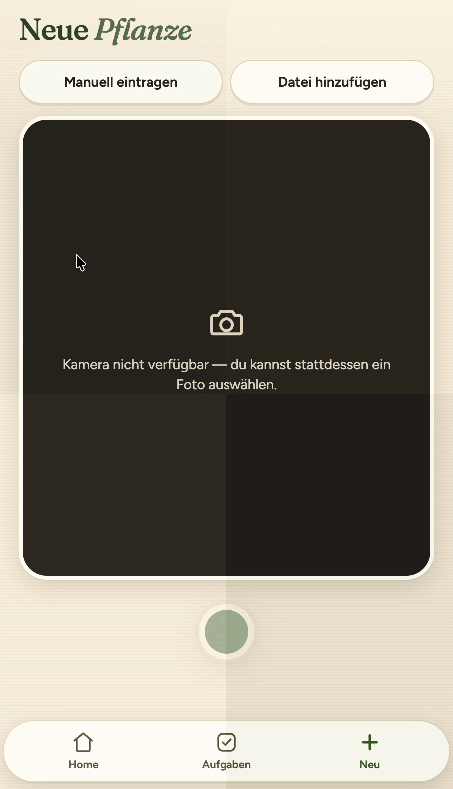
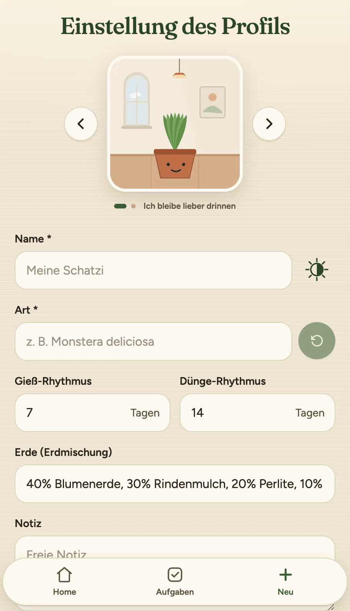
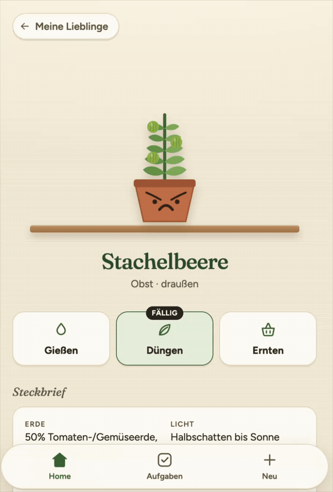
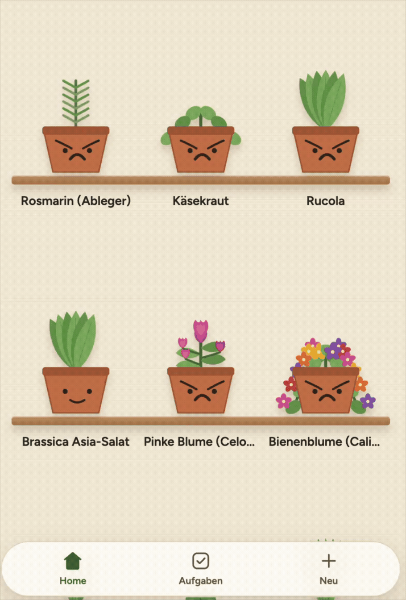

# Keep Growing

We find just "Keep your plants alive" (cc [another gardening app](https://getplanta.com/)) lame. We care about our home garden much more than keeping it alive.

So we built Keep Growing, an app for people who love their home garden. And be believe it is 100% cute. Just give it a look!

## Table of Contents

1. [Keep Growing web app](#keep-growing-web-app)
2. [Why Us?](#why-us)
3. [For fellow developers](#for-fellow-developers)
4. [About us](#about-us)
5. [License](#license)

## Keep Growing web app

Anne, our initiator, added all plants from her home garden to the digital garden of Keep Growing. Now she can comfortably check on them any time.

<p align="center">
  
</p>

Every pot reflects the live mood of the plant based on its watering and fertilizing schedule, highlighting needs without turning care into a chore list.

### Scan to add

<p align="center">
  
</p>

Snap a photo of your plant and our AI will generate a unique profile for it in your digital garden.

### Personalized profile picture

<p align="center">
  
</p>

Based on the plant specie, the profile picutre is automatically customized. Because every plant is unique!

### Record care about your plant

<p align="center">
  
</p>

Completing a watering or fertilizing action brings immediate joy to the displayed pot's face.

### Never part with your plants

Even the cranky ones.

<p align="center">
  
</p>

Transition plants that die to the memorial shelf. They are displayed as angel pots resting on a cloud and preserve their profiles and history.

## Why Us?

| | [Planta](https://getplanta.com/) | [PlantIn](https://myplantin.com) | [gardenize](https://gardenize.com) | Keep Growing |
| :--- | :--- | :--- | :--- | :--- |
| **Plan** | Subscription | Subscription | Subscription | **Pay as you go** |
| **Cost** | 4 EUR p.m. | 40 USD p.m. | 8 EUR p.m. | **0.001–0.01 USD per ID call** |
| **Cuteness** | <50% | <50% | <50% | **100%** |

Pay pennies for what you actually use, not dollars for subscriptions.

You do not need to provide any personal details to use the app. All data about your plants is stored locally on your device and never leaves it. And you get full transparency because Keep Growing is open source.

Finally, Keep Growing is 100% cute.

## For fellow developers

Before proceeding, make sure Node.js 22 or higher and npm are installed on your system. Anticipating your question, all platforms - including Windows, Linux and macOS - are supported.

### Installation

Clone the repository and run the following:

```bash
npm install  # installing dependencies
npm run dev  # launching the development server
```

Open `http://localhost:3000` in your browser. The application automatically creates and initializes the local SQLite database at `daten/lokal.db` on first run.

### Testing

In order to test your changes, run the test suite with:

```bash
npm test
```

This verifies care calculation logic, pot mood and growth progression rules, schedule due dates, and AI plant recognition.

## About us

Keep Growing was built by [Anne](https://github.com/KarClas), [Friedrich](https://github.com/FriedrichLueth-007), [Max](https://github.com/chep0k) and our agents within 48 hours at the [AI Hackathon by Startplatz](https://www.startplatz.de/event/ai-coding-hackathon-september-2026-09-04/).

Selected as the winner project by jury 🏆
Received much love from the audience 💕

## License

Licensed under [CC BY-NC 4.0](LICENSE). Free for private use; commercial use is prohibited.
